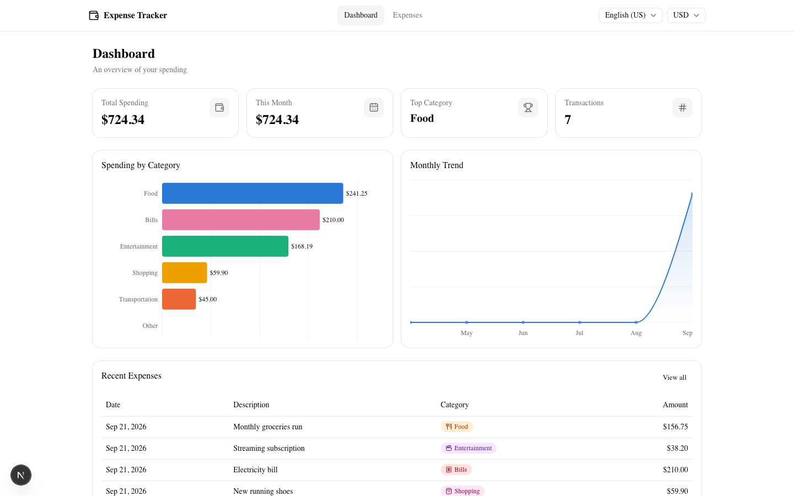
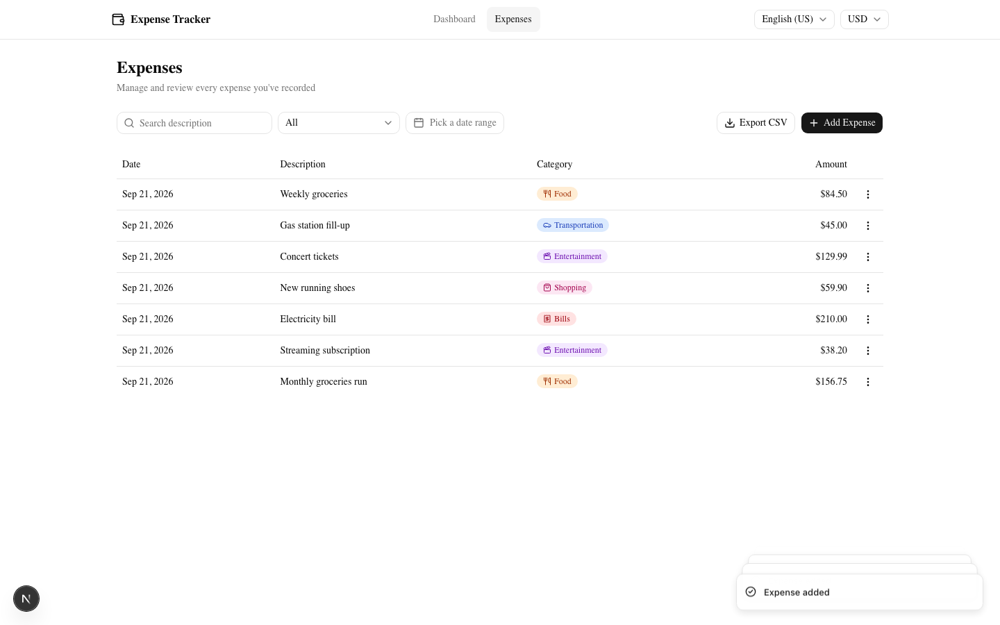
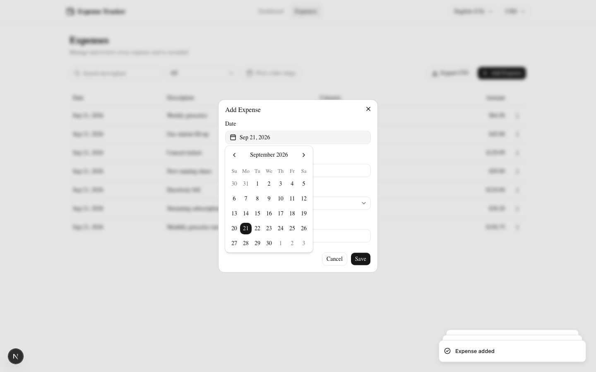
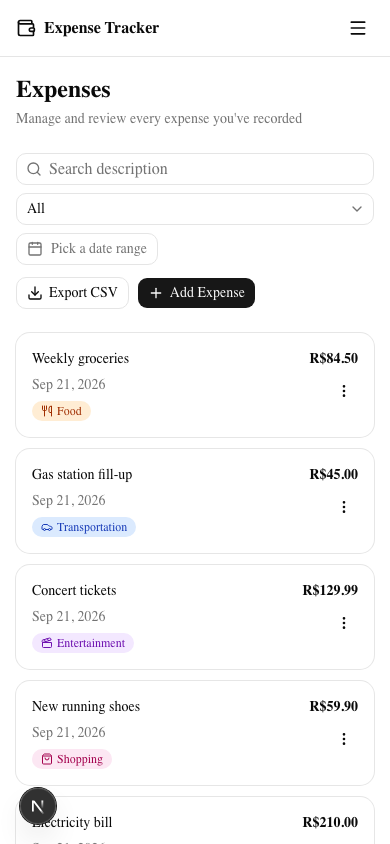

# Expense Tracker

A modern, professional personal expense tracker built with Next.js 16, React 19, and TypeScript. Add, edit, filter and export your expenses, and get a live dashboard with spending analytics — fully bilingual (English/Portuguese) and multi-currency, with data persisted locally in your browser.


**Live demo:** https://expenses-tracker-three-indol.vercel.app

## Screenshots

| Dashboard | Expenses |
|---|---|
|  |  |

| Add Expense | Mobile |
|---|---|
|  |  |

| Português (BR) | Multi-currency (BRL) |
|---|---|
|  |  |

## Features

- **Add, edit, delete expenses** — date, amount, category, and description, with full form validation (Zod + react-hook-form)
- **Dashboard analytics** — total spending, current-month spending, top category, transaction count, a spending-by-category chart, and a 6-month trend chart
- **Filtering & search** — by date range, category, and free-text description search
- **CSV export** — exports the currently filtered list
- **Categories** — Food, Transportation, Entertainment, Shopping, Bills, Other
- **Bilingual** — English (US) and Portuguese (BR), auto-detected from the browser and switchable at any time; URL-routed (`/en-US`, `/pt-BR`)
- **Multi-currency** — USD, BRL, EUR, CAD, GBP, defaulting from the detected language but independently changeable
- **Responsive** — a data table on desktop, a card list on mobile
- **Data persistence** — everything is stored in the browser's `localStorage`; no backend, no account needed

## Tech stack

- **Next.js 16** (App Router, Turbopack) + **React 19** with the React Compiler enabled
- **TypeScript**, **Tailwind CSS v4**, **shadcn/ui** (Base UI primitives)
- **next-intl** for i18n/routing, **Zod** + **react-hook-form** for forms, **Recharts** for charts
- **Vitest** + **React Testing Library** for the test suite

## Getting started

```bash
npm install
npm run dev
```

Open [http://localhost:3000](http://localhost:3000) — you'll be redirected to `/en-US` or `/pt-BR` depending on your browser's language.

### Available scripts

| Command | Description |
|---|---|
| `npm run dev` | Start the dev server |
| `npm run build` | Production build |
| `npm run start` | Serve the production build |
| `npm run lint` | Run ESLint |
| `npm run test` | Run the test suite once |
| `npm run test:watch` | Run tests in watch mode |
| `npm run test:coverage` | Run tests with coverage |

### Trying it out

1. Go to **Expenses** and click **Add Expense** — fill in an amount, pick a category and date, and save.
2. Try the **filters** (date range, category, search) and the **Export CSV** button.
3. Click a row's **⋮** menu to edit or delete an expense.
4. Visit **Dashboard** to see the summary cards and charts update live.
5. Switch **language** and **currency** from the header — notice they're independent of each other, and that the URL and all labels/categories switch immediately.
6. Resize the window (or open on a phone) to see the responsive card layout.

## Architecture

The codebase combines three organizing principles:

- **Feature-driven**: top-level folders under `src/features/` (`expenses`, `dashboard`, `settings`).
- **MVC within each feature**:
  - `model/` — types, Zod schemas, constants
  - `controller/` — React hooks that own state and orchestrate `services/`
  - `services/` — repositories behind an explicit TypeScript interface (e.g. `ExpenseRepository`) with a `LocalStorage*` implementation, so persistence could later be swapped for a real API without touching hooks or views
  - `view/` — page-level "section" components that wire controllers to shared UI
- **Atomic design** for shared UI in `src/components/`: `ui/` (shadcn primitives) → `atoms/` → `molecules/` → `organisms/`. Components like `ExpenseFilters` and `StatCard` are built as compound components (`<ExpenseFilters.Search />`, `<StatCard.Value />`, …) to avoid prop-drilling.

```
src/
├── app/[locale]/          # Next.js App Router pages (locale-prefixed)
├── components/            # atoms → molecules → organisms, plus shadcn/ui primitives
├── features/
│   ├── expenses/          # model, services, controller, view
│   ├── dashboard/
│   └── settings/          # locale + currency, shared via React context
├── i18n/                  # next-intl routing/navigation/request config
├── lib/                   # currency, date, storage, id helpers
└── messages/              # en-US.json, pt-BR.json
```

## CI/CD

- **CI** (`.github/workflows/ci.yml`) runs on every push and pull request: install, lint, test, and build.
- **CD**: the repository is connected to [Vercel](https://vercel.com)'s native GitHub integration, which builds and deploys automatically on every push to `main` — a preview deployment is also generated for every pull request. No extra workflow or secrets are needed for this.
